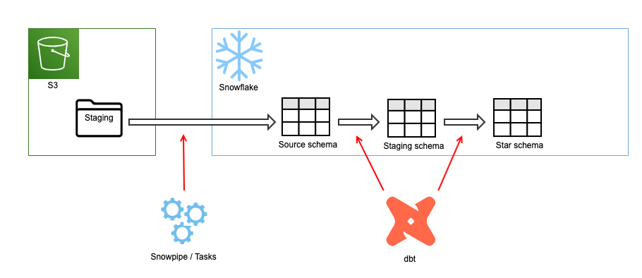

# Pagila ELT project with dbt and Snowflake

## Overview

This project builds an ELT pipeline to load the [Pagila](https://github.com/devrimgunduz/pagila) dataset into a star schema with Type 2 SCD (slowly changing dimensions) in Snowflake.  

### Tools used

- [Snowflake](https://www.snowflake.com/)
- [dbt](https://www.getdbt.com/)
- [Amazon S3](https://aws.amazon.com/s3/)
- [Terraform](https://www.terraform.io/)


# Solution design

## System design


The high-level system overview and the data flow are shown below.



The system consists of the following components:

- An Amazon S3 bucket (the staging area)
- A Snowflake database (the data warehouse)

It is assumed that raw data is extracted from a PostgreSQL database in an operational system as CSV files into the S3 bucket regularly. (The solution design does not include this part.)

The raw data is loaded into the source tables in Snowflake in two methods depending on the table type.

1. The dimension tables are loaded with [Snowflake Tasks](https://docs.snowflake.com/en/user-guide/tasks-intro.html) on a schedule.
2. The fact tables are loaded using [Snowpipes](https://docs.snowflake.com/en/user-guide/data-load-snowpipe-intro.html) as soon as extract files arrive at the S3 bucket.

Then, dbt transforms the source table data while loading them into the staging tables. Finally, dbt loads the staging table data into the final star schema fact and dimension tables. The Type 2 SCD tables are implemented using a dbt's functionality called [snapshots](https://docs.getdbt.com/docs/building-a-dbt-project/snapshots), and the fact table is implemented using [incremental materializations](https://docs.getdbt.com/docs/building-a-dbt-project/building-models/configuring-incremental-models). [Data quality checks](https://docs.getdbt.com/docs/building-a-dbt-project/tests) are also conducted by dbt. The scheduling of the dbt tasks can be done in [various ways](https://docs.getdbt.com/docs/running-a-dbt-project/running-dbt-in-production), but it is not included in this project.

## Data warehouse design

### Pagila 

The source tables are based on [Pagila](https://github.com/devrimgunduz/pagila), which is *a port of the Sakila example database available for MySQL, which was originally developed by Mike Hillyer of the MySQL AB documentation team.* 

The schema comprises 15 tables, as shown in the ER diagram below.


The Pagila database was created in a local PostgreSQL using Docker in this project. Then, the raw data was extracted as CSV files and manually uploaded into the S3 bucket. This process can be easily done in the cloud, for example, using [Amazon RDS for PostgreSQL](https://aws.amazon.com/rds/postgresql/) and [Amazon Managed Workflows for Apache Airflow (MWAA)](https://aws.amazon.com/managed-workflows-for-apache-airflow/), if necessary.


### The star schema

The target database in the data warehouse (Snowflake) is based on the [Pagila star schema example](https://learning.oreilly.com/library/view/pentaho-r-kettle-solutions/9780470635179/ch04.html#sakila) by Matt Casters, Roland Bouman and Jos van Dongen. The ER diagram is shown below.


There are two transaction tables in the source Pagila schema, rental and payment, but the only rental dataset is included as a fact table in the star schema in this project. All the dimension tables, except `dim_date` and `dim_time`, are treated as Type 2 [SDCs (slowly changing dimensions)](https://en.wikipedia.org/wiki/Slowly_changing_dimension).

### ELT data flow

As mentioned above, the data flow starts from the S3 bucket. Therefore, this project has only an "LT" data flow because the "E" (extract) step is not included.

Although the "E" step is not included in this project, the design of the extract files requires some consideration.

   - CSV files for the dimension tables contain the entire table data (= full extract). In the S3 bucket, new files overwrite the previous version (using S3 versioning), so the load process can always find the same files.

   - CSV files for the fact tables contain only the transactions that have happened since the previous extract. Therefore, each file name includes a timestamp to avoid overwriting the previous files.

In the "L" (load) step, the files are loaded into source tables in Snowflake by the COPY command through an external stage. The way to automate the load depends on the table type.

  - CSV files for the dimension tables 

      Snowflake Tasks execute the COPY command on a schedule. The Tasks can be scheduled at an interval of wait time up to 11520 minutes (= 8 days). In this setup, there are two dependent tasks for each source table: the first task truncates the source table, and the second task performs the load.

  - CSV files for the fact tables
      
      Snowpipe executes the COPY command in an event-driven manner. When an extract file arrives at the S3 bucket, S3 sends an event notification to [Amazon SQS](https://aws.amazon.com/sqs/), to which Snowflake subscribes. When Snowflake receives the notification, it runs the COPY command to load the extracted file.

Finally, the "T" (transform) step is performed by dbt.

   - The source data is copied to the staging models (materialised as views) while performing the following transformations.

     - Joins between source tables
     - Surrogate key generation using the [`dbt_utils.surrogate_key`](https://github.com/dbt-labs/dbt-utils#surrogate_key-source) macro.

   - The staging model is then copied to the marts models. There are three types of models in this step.
     
     - The fact table (`fact_rental`) is append-only. Therefore, it is defined as an [incremental model](https://docs.getdbt.com/docs/building-a-dbt-project/building-models/configuring-incremental-models).
     - The dimension tables (`dim_*`) are Type 2 SCDs, so the tables are implemented as [snapshots](https://docs.getdbt.com/docs/building-a-dbt-project/snapshots) to accommodate these requirements.
     - The static reference dimension tables (`dim_date` and `dim_time`) are implemented as standard `table` materialization. 

The final data lineage graph is shown below.


The advantage of using dbt is that these different materializations are supported out of the box. Implementing them without adding complicated logic in the SQL code is relatively straightforward.


# Deployment and operations

## Provisioning AWS and Snowflake infrastructure by Terraform

*If you don't have Terraform on your local machine, you can install it by following the [instuctions](https://learn.hashicorp.com/tutorials/terraform/install-cli).*

Create a file `vars.tfvars` in the `terraform` directory with the appropriate values for the variables. An example is shown below.

```
project_name           = "pagila"
env                    = "dev"
account_id             = "(Your AWS account ID)"
region                 = "eu-west-2"
s3_staging_bucket_name = "pagila-staging"
iam_role_name          = "terraform_s3_access_role"
snowflake_account      = "(Your Snowflake account ID)"
snowflake_region       = "(Your Snowflake region)"
snowflake_account_user = "(Your Snowflake account user)"
snowflake_password     = "(Your Snowflake account password)"
snowflake_database     = "PAGILA_DW"
snowflake_warehouse    = "PAGILA_WH"
snowflake_wh_size      = "x-small"
snowflake_schema       = "SRC"
snowflake_stage        = "PAGILA_STAGE"
```

Then provision the AWS and Snowflake infrastructure by running the terraform commands.

```
$ cd terraform
$ terraform init
$ terraform plan -var-file=vars.tfvars
$ terraform apply -var-file=vars.tfvars
```

## Uploading the raw files to S3

The extract files are stored in `postgresql/staging` directory. The files can be manually uploaded to simulate the "E" step of the ETL process, as shown below.

```
$ cd postgresql/staging
$ aws s3 cp staging/batch s3://pagila-staging2/pagila/batch/ --recursive
$ aws s3 cp staging/events/rental_20220101.csv s3://pagila-staging2/pagila/events/
$ aws s3 cp staging/events/rental_20220102.csv s3://pagila-staging2/pagila/events/
...
```

## Running dbt

To simulate the "L" and "T" steps of the ETL process, execute the dbt commands below.

```
$ cd dbt
$ dbt run
$ dbt snapshot
$ dbt test
```

# Future enhancement plans

The following functionality is yet to be implemented.

- Data visualisation layer 
- dbt job automation 
- CI/CD pipeline integration

